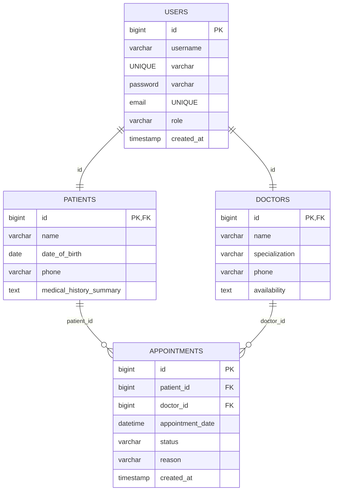

# Database Schema Design: Smart Clinic Management System

This document outlines the dual-database architecture used by SmartCare Solutions. We utilize **MySQL** for structured, transactional, relational data, and **MongoDB** for flexible, nested clinical data.

---

## 1. 🐬 MySQL Relational Database Design
The relational schema models user roles, profiles, and scheduled appointments. Relationships are configured with foreign key mappings and cascading deletion rules.



### Table Definitions & Column Metadata

#### A. `users` Table
*Stores core login credentials and security roles.*
* `id` (BIGINT, Primary Key, Auto-Increment): Unique user identifier.
* `username` (VARCHAR(100), Unique, Not Null): Login name.
* `password` (VARCHAR(255), Not Null): BCrypt hashed credentials.
* `email` (VARCHAR(100), Unique, Not Null): User email address.
* `role` (VARCHAR(20), Not Null): Auth role (`ADMIN`, `DOCTOR`, `PATIENT`).
* `created_at` (TIMESTAMP): Account registration timestamp.

#### B. `doctors` Table
*Stores professional profile information for practitioners.*
* `id` (BIGINT, Primary Key, Foreign Key -> `users.id` ON DELETE CASCADE): Links back to the base security profile.
* `name` (VARCHAR(100), Not Null): Doctor's full name.
* `specialization` (VARCHAR(100), Not Null): Field of practice.
* `phone` (VARCHAR(20), Not Null): Active contact number.
* `availability` (TEXT): Free hours description (e.g. "Mon-Fri 09:00 - 17:00").

#### C. `patients` Table
*Stores demographic and medical history parameters.*
* `id` (BIGINT, Primary Key, Foreign Key -> `users.id` ON DELETE CASCADE): Links back to the base security profile.
* `name` (VARCHAR(100), Not Null): Patient's full name.
* `date_of_birth` (DATE, Not Null): DOB for calculation of age/treatment criteria.
* `phone` (VARCHAR(20), Not Null): Emergency contact number.
* `medical_history_summary` (TEXT): Chronic conditions summary.

#### D. `appointments` Table
*Models structured consultation bookings.*
* `id` (BIGINT, Primary Key, Auto-Increment): Unique consultation ID.
* `patient_id` (BIGINT, Foreign Key -> `patients.id` ON DELETE CASCADE): The booking patient.
* `doctor_id` (BIGINT, Foreign Key -> `doctors.id` ON DELETE CASCADE): The requested consultant.
* `appointment_date` (DATETIME, Not Null): Slotted consultation date/time.
* `status` (VARCHAR(20), Not Null): Booking state (`SCHEDULED`, `COMPLETED`, `CANCELLED`).
* `reason` (VARCHAR(255), Not Null): Primary symptoms / reason for booking.
* `created_at` (TIMESTAMP): Date request was recorded.

---

## 2. 🍃 MongoDB Document Database Design (NoSQL)
Flexible unstructured clinical parameters like prescriptions are stored in a document model. This supports variable lists of medicines, varying frequencies, dosage properties, and variable diagnosis logs without bloating relational tables.

### Collection: `prescriptions`
```json
{
  "_id": "ObjectId",
  "appointmentId": "Number (Foreign key ref to MySQL appointments)",
  "patientId": "Number (Foreign key ref to MySQL patients)",
  "doctorId": "Number (Foreign key ref to MySQL doctors)",
  "patientName": "String",
  "doctorName": "String",
  "prescriptionDate": "ISODate",
  "symptoms": ["String"],
  "diagnosis": "String",
  "medications": [
    {
      "name": "String",
      "dosage": "String",
      "frequency": "String",
      "duration": "String"
    }
  ],
  "instructions": "String"
}
```
